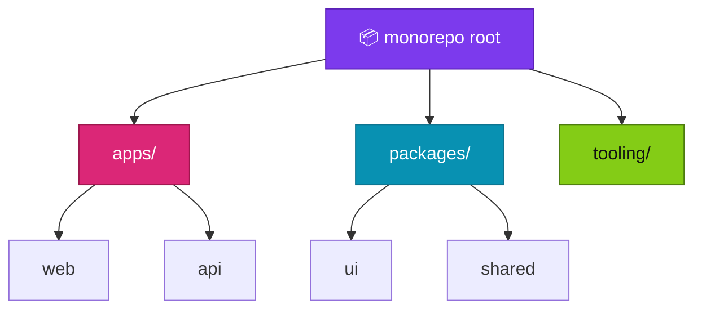

<p align="center">
  
</p>

<h1 align="center">monorepo-structure-guide</h1>

<p align="center">
  <strong>EN</strong> Suggested layouts & tooling notes for monorepos<br/>
  <strong>PT</strong> Layouts sugeridos e notas de tooling para monorepos
</p>

<p align="center">
  <a href="https://github.com/manansbdb/monorepo-structure-guide/blob/main/LICENSE"></a>
  
  
  <a href="#support--apoio"></a>
</p>

---

## What it does / Para que serve

| English | Português |
|---------|-----------|
| Suggested **monorepo layouts** and tooling notes (workspaces, packages, apps). | **Layouts de monorepo** sugeridos e notas de tooling (workspaces, packages, apps). |
| Use as a blueprint when splitting a growing codebase. | Usa como blueprint ao dividir um codebase em crescimento. |



---

## Install / Instalação

### 1) Clone / Clona

```bash
git clone https://github.com/manansbdb/monorepo-structure-guide.git
cd monorepo-structure-guide
```

### 2) Copy docs into your repo / Copia docs

```bash
mkdir -p docs/architecture
cp layouts.md docs/architecture/monorepo-layouts.md
cp tooling-notes.md docs/architecture/monorepo-tooling.md
```

### Requirements / Requisitos

- `git`
- Optional: npm/pnpm/yarn workspaces or similar

---

## Quick start / Início rápido

```bash
git clone https://github.com/manansbdb/monorepo-structure-guide.git
# read layouts.md → pick apps/ + packages/ → adapt tooling-notes.md
```

---

## Contents / Conteúdos

| Path | Purpose / Função |
|------|------------------|
| `layouts.md` | Folder layout options |
| `tooling-notes.md` | Workspaces / CI tips |
| `SUPPORT.md` | Donations / Doações |

---

## Project layout / Estrutura

```text
monorepo-structure-guide/
├── docs/banner.svg
├── layouts.md
├── tooling-notes.md
├── SUPPORT.md
└── README.md
```

---

## Support / Apoio

Bitcoin donations welcome / Doações em Bitcoin bem-vindas:

```
bc1q0qfnlnxyum9u45stzxe0a7jnhtj4j0usfkqdjw
```

See [SUPPORT.md](./SUPPORT.md).

---

## License / Licença

[MIT](./LICENSE) © 2026 manansbdb
